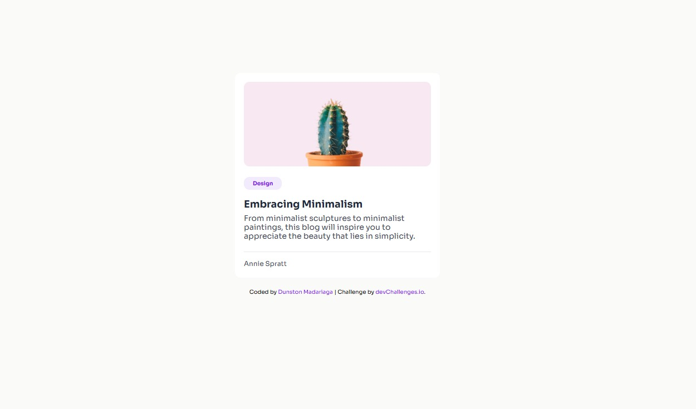

<!-- Please update value in the {}  -->

<h1 align="center">Minimal Blog Card | devChallenges</h1>

   Solution for a challenge <a href="https://devchallenges.io/challenge/minimal-blog-card" target="_blank">Minimal Blog Card</a> from <a href="http://devchallenges.io" target="_blank">devChallenges.io</a>.

  <h3>
    <a href="https://devchallenge-minimal-blog-card.netlify.app">
      Demo
    </a>
     | 
    <a href="{https://your-url-to-the-solution}">
      Solution
    </a>
     | 
    <a href="https://devchallenges.io/challenge/minimal-blog-card">
      Challenge
    </a>
  </h3>

<!-- TABLE OF CONTENTS -->

## Table of Contents

- [Overview](#overview)
  - [What I learned](#what-i-learned)
  - [Useful resources](#useful-resources)
- [Built with](#built-with)
- [Features](#features)
- [Contact](#contact)
- [Acknowledgements](#acknowledgements)

<!-- OVERVIEW -->

## Overview

### What I learned

There was not much complication, except for the mythical “how to center a div”, although there are many ways to do it I decided to center it with flexbox.

### Useful resources

[Box-sixing](https://www.paulirish.com/2012/box-sizing-border-box-ftw/)

[Normalize](https://necolas.github.io/normalize.css/8.0.1/normalize.css)

### Built with

- Semantic HTML5 markup
- CSS custom properties
- Flexbox

## Features

This application/site was created as a submission to a [DevChallenges](https://devchallenges.io/challenges-dashboard) challenge.

## Author

- Website [your-website.com](https://{your-web-site-link})
- GitHub [@your-username](https://{github.com/your-usermame})
